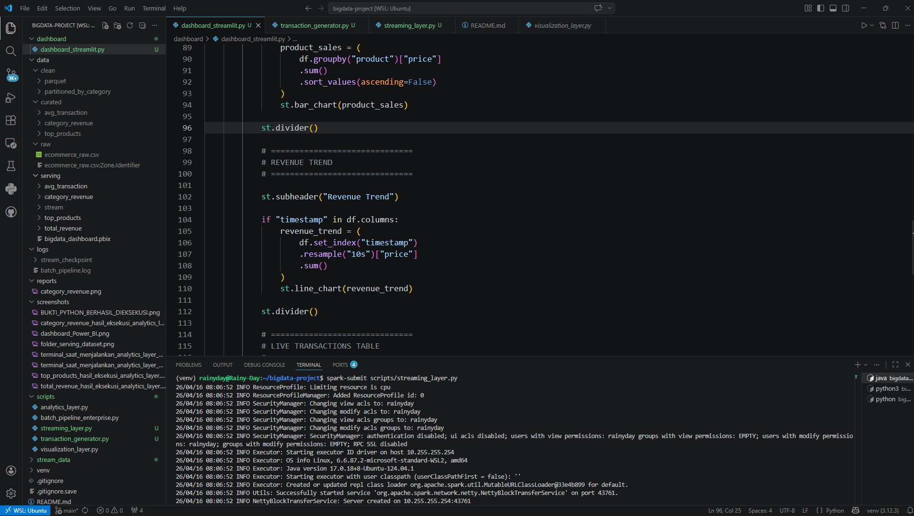
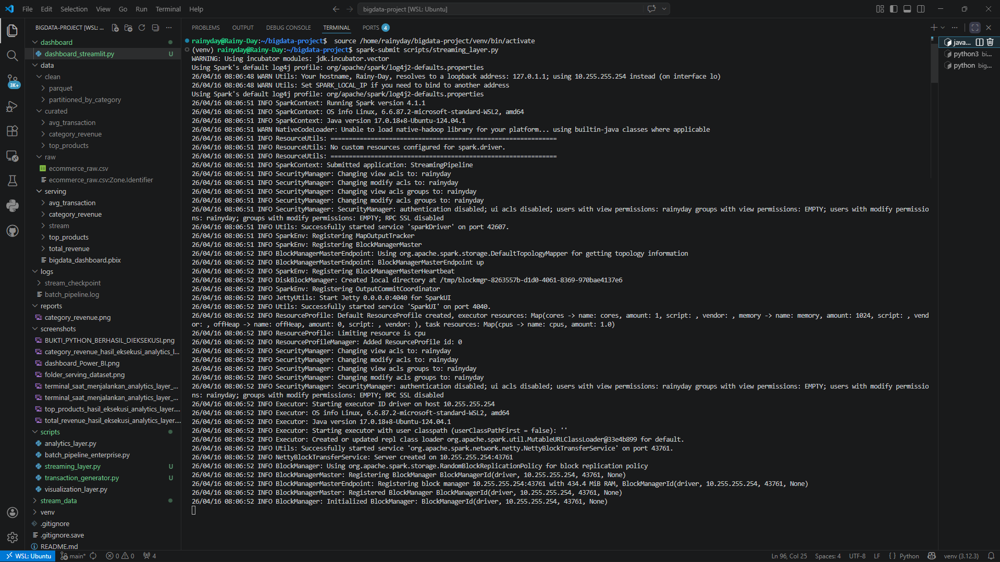
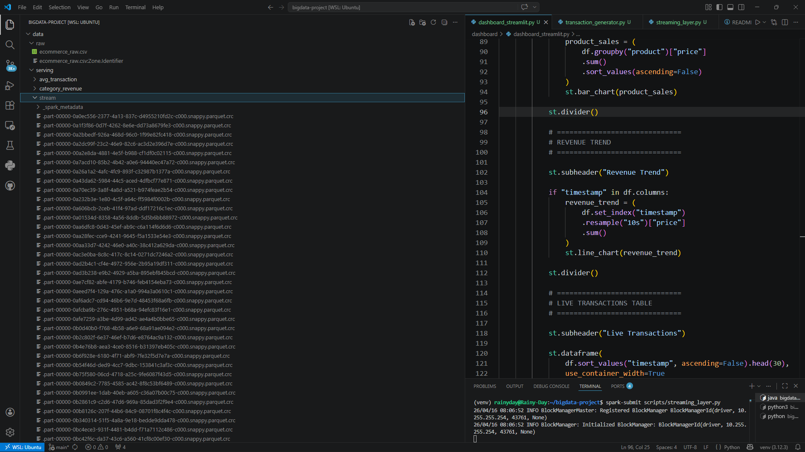
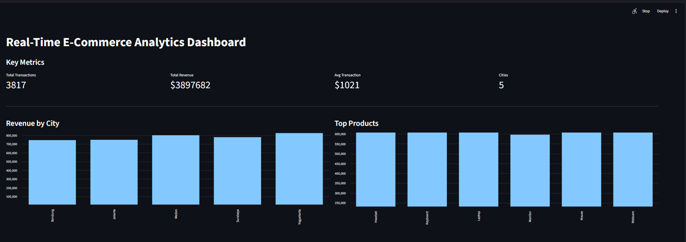

# 🌧️ Real-Time Streaming Analytics & Dashboard

**Modul Praktikum 4 - Big Data Technology**


Sistem ini mengimplementasikan pipeline pemrosesan data secara real-time menggunakan **Spark Structured Streaming** dan **Streamlit**. Lingkungan ini berjalan sepenuhnya di atas **WSL Ubuntu** untuk simulasi infrastruktur Big Data yang stabil.

## 👤 Identitas Mahasiswa

  - **Nama:** Hujan (Ivan Dwika Bagaskara)
  - **NIM:** 230104040205
  - **Program Studi:** Teknologi Informasi

## 🏗️ Arsitektur Pipeline

Alur data dalam praktikum ini adalah sebagai berikut:

1.  **Transaction Generator**: Simulasi pengiriman data JSON setiap 3 detik.
2.  **Spark Structured Streaming**: Membaca data secara micro-batch dari folder `stream_data/`.
3.  **Serving Layer**: Menyimpan hasil ke **Parquet Data Lake** di `data/serving/stream/`.
4.  **Dashboard**: Visualisasi real-time menggunakan Streamlit pada port 8501.

## 📂 Struktur Proyek

[cite_start]Sesuai panduan struktur folder praktikum [cite: 100-109]:

```text
BIGDATA-PROJECT/
├── data/
│   └── serving/
│       └── stream/              # Output Parquet (Serving Layer)
├── dashboard/
│   └── dashboard_streamlit.py   # Visualisasi Dashboard
├── scripts/
│   ├── streaming_layer.py       # Engine Spark Structured Streaming
│   └── transaction_generator.py # Simulator Event Transaksi
├── stream_data/                 # Raw data (JSON events)
├── screenshots/                 # Folder dokumentasi bukti praktikum
└── README.md
```
## 🚀 Cara Menjalankan

1.  Aktifkan venv di WSL: `source venv/bin/activate`.
2.  Jalankan 3 terminal WSL untuk perintah berikut:
      - **T1**: `spark-submit scripts/streaming_layer.py`
      - **T2**: `python3 scripts/transaction_generator.py`
      - **T3**: `python -m streamlit run dashboard/dashboard_streamlit.py`
-----
## 📸 Output Wajib (Dokumentasi Tugas)

### 1. Struktur Project
Menampilkan susunan folder utama termasuk `scripts`, `dashboard`, dan `data`.


### 2. Generator Transaksi Berjalan
Bukti bahwa `transaction_generator.py` berhasil membuat file JSON setiap 3 detik.


### 3. Spark Streaming Engine Berjalan
Terminal yang menunjukkan Spark sedang aktif memproses *micro-batches*.


### 4. Folder Serving (Parquet Dataset)
Daftar file `.parquet` yang terbentuk secara otomatis di `data/serving/stream`.


### 5. Real-Time Dashboard (Streamlit)
Visualisasi akhir yang menampilkan metrik dan grafik secara live.

