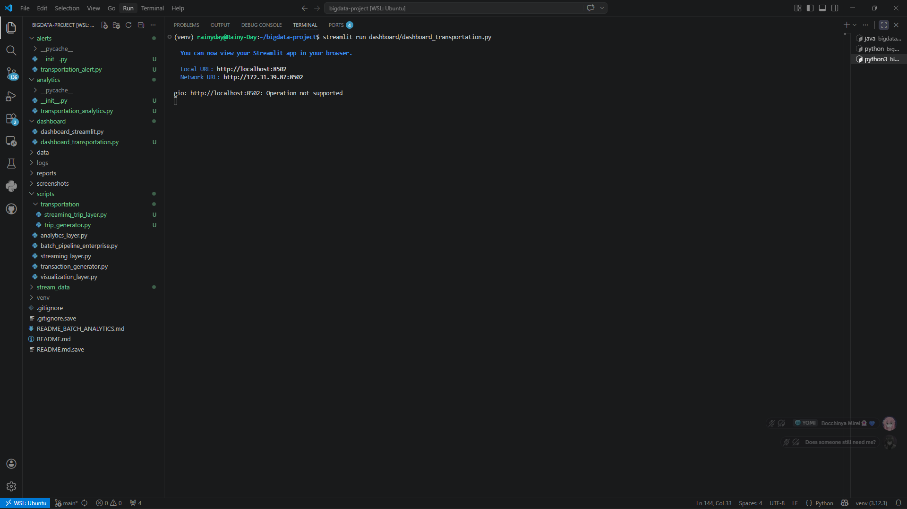
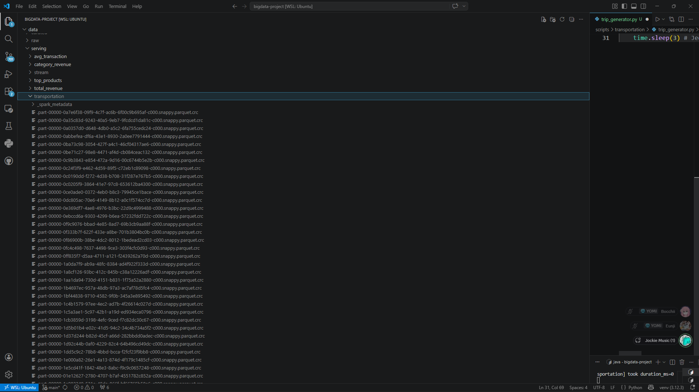
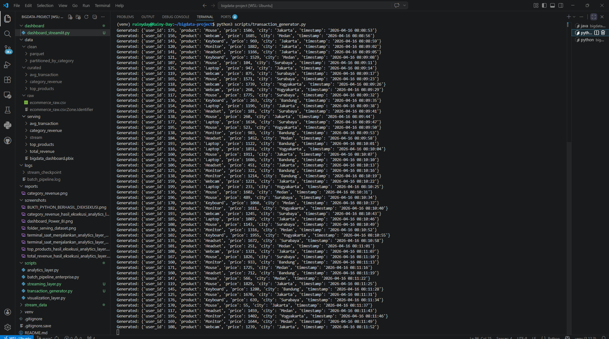
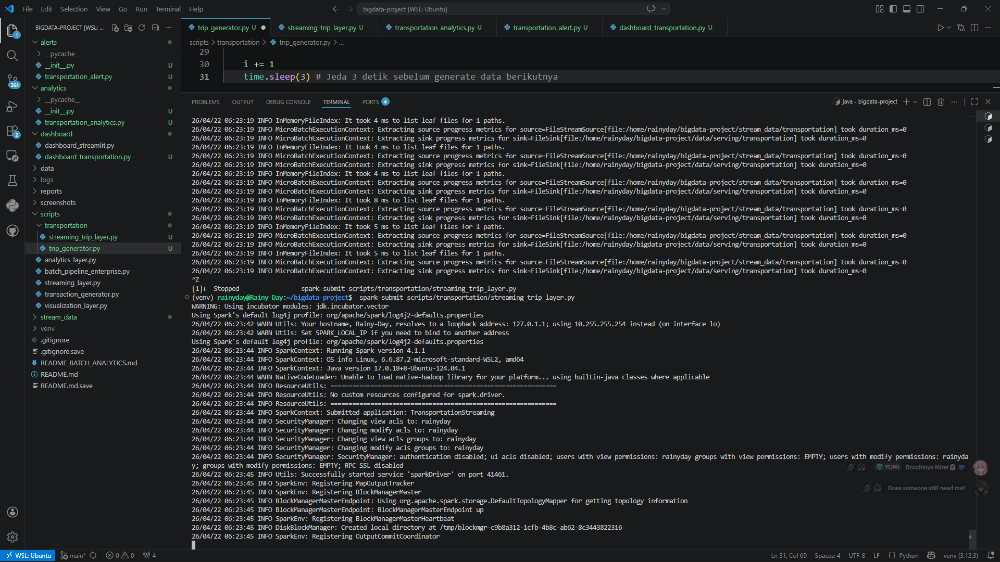

# 🚗 Smart Transportation: Real-Time Analytics Platform
<p align="center">
  
  
  
  
  
</p>

---

## 👤 Profil Pengembang
* **Nama:** Ivan Dwika Bagaskara (Rain)
* **NIM:** 230104040205
* **Prodi:** Teknologi Informasi
* **Instansi:** UIN Antasari Banjarmasin
* **GitHub:** [Rainyday404](https://github.com/Rainyday404)

## 👨‍🏫 Dosen Pengampu
* **Nama:** Muhayat, M.IT
* **GitHub:** [muhayat-lab](https://github.com/muhayat-lab)

---

## 📝 Deskripsi Proyek
Proyek ini adalah platform **Real-Time Analytics** yang dirancang untuk memantau data transportasi secara instan. Menggunakan arsitektur Big Data modern, sistem ini mensimulasikan data perjalanan (Trip), memprosesnya menggunakan **PySpark Structured Streaming**, dan memvisualisasikannya melalui dashboard interaktif.

### Fitur Utama:
- ⚡ **Real-Time Pipeline:** Pemrosesan data tanpa jeda dari JSON ke format Parquet.
- 📊 **Dynamic Dashboard:** Visualisasi tren mobilitas dan distribusi kendaraan per 10 detik.
- 🚦 **Intelligent Alerting:** Peringatan otomatis jika terjadi lonjakan trafik atau harga tidak wajar.
- 🛠️ **Modular Design:** Pemisahan logika analisis (`analytics`) dan sistem peringatan (`alerts`).

---

## 📂 Struktur Project
```text
BIGDATA-PROJECT/
├── alerts/                # Modul sistem peringatan (Alerting System)
├── analytics/             # Modul logika analisis data (Metrics)
├── dashboard/             # Antarmuka visual (Streamlit)
├── data/
│   ├── checkpoints/       # Metadata streaming Spark
│   └── serving/           # Data hasil olahan (Parquet format)
├── scripts/
│   └── transportation/    # Script Generator & Pipeline Streaming
└── screenshots/           # Dokumentasi visual praktikum
````

-----

## ⚙️ Panduan Menjalankan Sistem

Jalankan setiap perintah pada terminal terpisah di dalam root project:

1.  **Jalankan Data Generator:**
    ```bash
    python scripts/transportation/trip_generator.py
    ```
2.  **Jalankan Spark Streaming:**
    ```bash
    spark-submit scripts/transportation/streaming_trip_layer.py
    ```
3.  **Jalankan Streamlit Dashboard:**
    ```bash
    streamlit run dashboard/dashboard_transportation.py
    ```

-----

## ## 🌧️ Output Wajib (Dokumentasi Tugas)

### A. Persiapan & Struktur
| Komponen | Screenshot |
| :--- | :---: |
| **Struktur Project** |  |
| **Data Serving** |  |

### B. Proses Streaming & Generation
| Komponen | Screenshot |
| :--- | :---: |
| **Data Generator** |  |
| **Spark Engine** |  |

### C. Analisis & Visualisasi (Insight)
| Fitur | Screenshot |
| :--- | :---: |
| **Dashboard Utama** | _1.png) |
| **Analisis Grafik** | _2.png) |
| **Deteksi Anomali** | _3.png) |
-----
