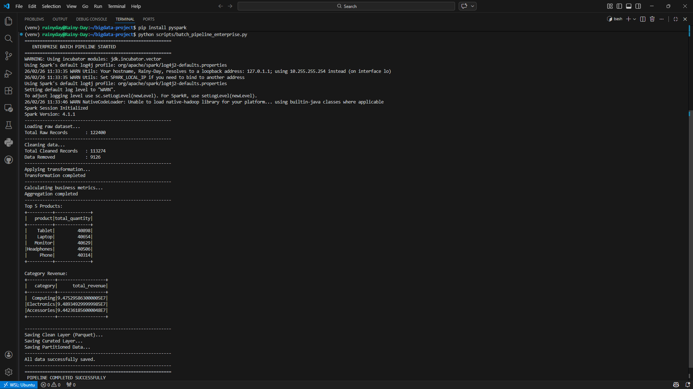

# Enterprise PySpark Batch Data Pipeline

Proyek ini adalah implementasi Data Pipeline berbasis Batch Processing menggunakan Apache Spark (PySpark). Pipeline ini dirancang untuk mensimulasikan proses ETL (Extract, Transform, Load) skala perusahaan, mulai dari pembersihan data mentah hingga penyimpanan data teragregasi ke dalam format Parquet.

## Fitur Utama

* **Schema Enforcement:** Menentukan struktur data secara eksplisit untuk menjamin integritas data.
* **Data Cleaning:** Menghapus duplikat, menangani missing values pada kolom kritikal, dan memfilter data transaksi yang tidak valid.
* **Data Transformation:** Melakukan kalkulasi bisnis seperti total_amount per transaksi.
* **Data Aggregation:** Menghitung metrik bisnis utama termasuk total pendapatan per kategori, produk terlaris, dan rata-rata nilai transaksi.
* **Storage Management:** Menyimpan hasil akhir ke dalam format Parquet dengan teknik partitioning untuk optimasi kueri.
* **Logging & Monitoring:** Dilengkapi dengan sistem logging untuk melacak status eksekusi pipeline.

## Prasyarat

Sebelum menjalankan pipeline ini, pastikan sistem Anda telah terinstal:

* Python 3.x
* Java (OpenJDK 11/8)
* Apache Spark
* PySpark Library

## Struktur Proyek

```text
bigdata-project/
├── data/
│   ├── raw/                # Dataset mentah (CSV)
│   ├── clean/              # Data hasil pembersihan (Parquet)
│   └── curated/            # Data hasil agregasi (Business Metrics)
├── logs/                   # Log eksekusi pipeline
├── scripts/
│   └── batch_pipeline_enterprise.py  # Script utama PySpark
├── venv/                   # Virtual environment
└── README.md

```

## Cara Menjalankan

1. **Aktifkan Virtual Environment:**
`source venv/bin/activate`
2. **Instal Dependensi:**
`pip install pyspark`
3. **Jalankan Pipeline:**
`python scripts/batch_pipeline_enterprise.py`

## Hasil Pemrosesan

Pipeline ini menghasilkan beberapa layer data di folder data/curated/:

* **category_revenue:** Total pendapatan per kategori.
* **top_products:** Daftar 5 produk dengan penjualan terbanyak.
* **avg_transaction:** Kebiasaan belanja rata-rata per pelanggan.

## Bukti Eksekusi Program

---

**Author:** **Ivan Dwika Bagaskara** *Rain*
